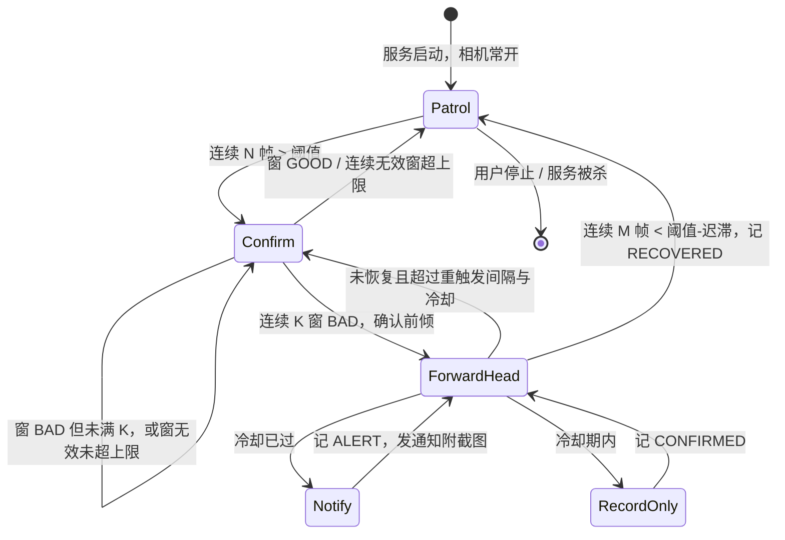

# 颈椎卫士 NeckGuard 设计文档

## 1. 背景与目标

长时间伏案时头部不自觉前伸（forward head posture，俗称"乌龟颈"）是颈椎劳损的主要诱因之一。本项目用一台放在身体侧面的摄像头设备，不定时抓拍并判断头部是否明显前倾，一旦确认就提醒用户，并附上当时的截图作为直观反馈。

分三个阶段推进：

| 阶段 | 检测端 | 通知方式 | 状态 |
|------|--------|----------|------|
| v1 | Android 手机 | 本机通知 + 截图 | 本文档主体 |
| v1.5 | 电脑（手机当无线相机） | 电脑通知 + 截图 | v0.6 起，见第 10 节 |
| v2 | Android 手机 | 上报服务器，服务器推送到主手机（iOS / Android） | 预留接口 |
| v3 | 独立硬件小盒子（树莓派 + 摄像头） | 同 v2 | 规划 |

v1 的目标是验证"侧面摄像头 + 姿态关键点 + 角度阈值"这条路线在真实场景里的误报率和漏报率是否可接受，为后两个阶段打基础。

## 2. 开源方案调研

| 来源 | 关键做法 | 借鉴点 |
|------|----------|--------|
| [spmallick/learnopencv: Posture-analysis-system-using-MediaPipe-Pose](https://github.com/spmallick/learnopencv/tree/master/Posture-analysis-system-using-MediaPipe-Pose) | 侧视图，耳肩连线与竖直夹角为颈部倾角，髋肩连线与竖直夹角为躯干倾角；`neck < 40 且 torso < 10` 为好姿势；左右肩 x 偏移 `< 100 px` 判定是否正侧面；连续 180 s 坏姿势才报警 | 角度公式、侧面对齐检查、持续时间门槛 |
| [tanisheesh/PosturePro](https://github.com/tanisheesh/PosturePro) | 同上算法的浏览器版 + Python 版，GPL-3 | 阈值一致性验证 |
| [DDULDDUCK/pose-nudge](https://github.com/DDULDDUCK/pose-nudge) | Rust + YOLO11n-pose 桌面应用，AGPL。先采集个人基线，之后按"当前值 > 基线 + 容差"判定；最近 3 次结果里至少 2 次异常才算异常 | 基线校准、时间窗投票去抖，对降低误报最有效 |
| [YoussefNim/forward_head_posture_alert](https://github.com/YoussefNim/forward_head_posture_alert) | 用耳 / 肩关键点的 z 深度差，阈值 0.35，持续 5 s | z 值不稳定，不采用；持续时间思路保留 |
| 临床文献（颅椎角 CVA） | 耳屏到 C7 连线与水平线的夹角，CVA < 50° 判为头前倾 | CVA 约等于 90° 减颈部倾角，与 40° 阈值吻合 |

结论：

- 只用 MediaPipe 的 2D 归一化坐标和 visibility，不用 z 深度。
- 只做侧视图，用户需求本身就是侧面摄像头。
- 融合三个要素：绝对阈值兜底、个人基线校准、连续窗投票 + 冷却。

## 3. 技术选型

| 项目 | 选型 | 说明 |
|------|------|------|
| 姿态模型 | MediaPipe Tasks Vision `com.google.mediapipe:tasks-vision:1.0.0` | 33 个关键点，含耳 (7/8)、肩 (11/12)、髋 (23/24)，每点带 visibility |
| 模型文件 | `pose_landmarker_lite.task`，约 5.8 MB | Gradle 任务在构建时下载到 assets，不提交二进制 |
| 相机 | CameraX 1.5.3 | ImageAnalysis 取帧，`STRATEGY_KEEP_ONLY_LATEST`，默认 640x480，YUV_420_888；镜头可选前置/后置/后置超广角 |
| 后台常驻 | `LifecycleService` + `foregroundServiceType="camera"` + partial WakeLock | Android 14+ 后台用相机的硬性要求；v0.3 起相机常驻绑定 |
| UI | Jetpack Compose，BOM 2026.06.01，Material 3 | 三个页面，PreviewView 用 AndroidView 包一层 |
| 设置与事件 | DataStore Preferences + JSONL 事件文件 + JPEG 快照目录 | v1 不引入 Room |
| 构建 | AGP 8.13.2 / Gradle 8.14.5 / Kotlin 2.2.21 / JDK 17；compileSdk 36，targetSdk 35，minSdk 26 | Kotlin 2.2.x 与 AGP 8.13 兼容性最稳 |
| CI | GitHub Actions `ubuntu-latest`：`testDebugUnitTest` + `assembleDebug`，上传 `app-debug.apk` | 本机无 Android SDK |
| PC 原型 | Python 3.11 + `mediapipe==1.0.1` + `opencv-python` | 调阈值；也是 v3 树莓派的代码基础 |

不选 iOS 做检测端的原因：iOS 应用退到后台或锁屏后不能继续使用相机（需要 Apple 单独审批的 entitlement），且侧载签名 7 天过期，不适合长时间常驻。

## 4. 算法定义

Kotlin 端 `pose/PostureGeometry.kt`、`pose/PostureAnalyzer.kt` 与 Python 端 `tools/posture_geometry.py` 使用完全一致的定义。

### 4.1 选可见侧（v0.7 起看整条链 + 切换粘性）

**v0.6 及更早**只比左右耳的 visibility。问题在于耳肩髋是串联关系，一个点崩掉整条向量都会崩，而耳朵清楚不代表同侧的肩和髋也清楚。左耳 0.91 / 左肩 0.54 / 左髋 0.52 对上右耳 0.82 / 右肩 0.94 / 右髋 0.96 时，旧逻辑会选明显更不稳的左侧。

**v0.7 起**一侧的可用度取该侧链上最弱的一点，并分成两档：

```
neckScore = min(ear, shoulder)              // 耳肩链
fullScore = min(neckScore, hip)             // 含髋的整条链
```

先比 `fullScore`；**两侧的 `fullScore` 都低于 `minVisibility` 时改比 `neckScore`**。因为伏案时两边的髋经常一起被桌子挡住，这时两个 `fullScore` 都接近 0，直接比会退化成掷硬币。

还有**切换粘性**：传入上一帧用的侧别后，另一侧要高出 `sideSwitchMargin`（默认 0.15）才换边。两边得分接近时逐帧翻转会让角度无谓跳变，而左右关键点的预测位置本来就有几度系统差异。

`PostureGeometry.analyze` 保持纯函数，这点状态由 `SideAndTorsoMemory` 持有（Python 同名类），三个调用方共用同一套语义。耳与肩的 visibility 都必须 `>= 0.5`，否则该帧记为 `LowVisibility`；关键点列表为空记为 `NoPerson`。

### 4.2 侧面对齐检查

```
torsoLen       = dist(shoulder, hip)          // 髋不可见时退化为 dist(ear, shoulder) * 2
shoulderOffset = |x_farShoulder - x_nearShoulder| / torsoLen
```

- `shoulderOffset < 0.35` 且有躯干线时帧结果为 `Valid`。
- 否则为 `Misaligned`，仅用于 UI 提示调整摆放角度，不计入判定。
- 远侧肩膀 visibility 低于 0.5 时视为被身体挡住，恰好说明是正侧面，offset 记为 0。
- 对齐但没有躯干线时为 `NoTorso`（见 4.3），同样不计入判定。

### 4.3 颈部前倾角（主指标，v0.5 起相对躯干线）

所有坐标先由归一化值乘以图像宽高还原为像素坐标，否则非正方形图像会让角度畸变。

**v0.4 及更早**用的是耳肩连线与竖直方向的夹角。这个定义有个硬伤：它把"身体整体的倾斜"也算进了颈部角度。躺着时头和身体明明在一条直线上，耳肩连线却是水平的，算出来 90°，必然误报；伏案时躯干前倾 10°，颈部角度也凭空多 10°。

**v0.5 起**改为耳肩连线与髋肩连线（躯干线）的夹角，即头相对自己身体的前伸程度：

```
d    = shoulder - hip          // 躯干方向，由髋指向肩
n    = ear - shoulder          // 颈部方向
cos  = dot(d, n) / (|d| · |n|)
neck = acos(cos)  转成角度，范围 0..180
```

头与躯干共线时为 0°，与身体朝向、是坐是躺都无关。几个对照（同一组关键点，两种口径）：

| 姿势 | 相对躯干线（新） | 相对竖直线（旧） |
|------|------|------|
| 躺平，头与身体共线 | 0° | 90°（误报） |
| 躺着但头真的前伸 | 44.6° | 45.4° |
| 端坐、头明显前伸 | 36.9° | 36.9° |
| 伏案躯干前倾 20°，头随身体 | 2.5° | 8.4° |

躯干倾角 `torso = angle(hip -> shoulder, 竖直向上)` 仍按旧公式计算，只做显示与记录，不参与判定。

**没有躯干线的帧**：髋 visibility 低于 0.5，或髋肩距离不足耳肩距离的 0.8 倍（髋点落在肩上，方向是噪声）时，本帧没有可靠的躯干线。

**v0.7 起先尝试沿用最近一次可靠的躯干方向**（`torsoHoldMillis`，默认 2 秒）。躯干方向变化远比帧间隔慢，手抬起来挡一下髋的一两秒里它几乎不动，而退回竖直参考等于换了口径：伏案（躯干前倾约 33°）时同一个姿势，相对躯干线是 11.4°，相对竖直线是 35.0°，人没动角度却跳了 23.6°，直接越过 35° 阈值误报。沿用期内 `neckReference` 记为 `TORSO_HELD`，与 `TORSO` 同口径，**照常参与判定**。

沿用的帧不给自己续期，否则髋一直不出现也能无限续下去。超过保留期后才退化为竖直口径（`VERTICAL`），此时记为 `NoTorso` 仅供 UI 显示，**不计入判定**。设置页的"必须看到髋部"关掉后改为退回竖直参考并照常判定，适合髋部长期被桌子挡住、且不会躺着用的场景。

### 4.4 校准与迟滞

- 校准：用户端正坐好点"校准"，取 3 s 内有效帧前倾角的中位数作为 `baseline`；有效帧少于 10 则校准失败。
- 阈值：

```
threshold = baseline == null ? 35° : clamp(baseline + 12°, 20°, 50°)
```

绝对阈值与 clamp 下限比 v0.4 低（40 → 35、30 → 20），因为新口径扣掉了躯干本身的前倾，同样的姿势算出的角度更小。

- 迟滞：进入前倾需 `median > threshold`，退出前倾需 `median < threshold - 4°`，避免在临界值附近反复翻转。
- 升级迁移：DataStore 里存了 `geometry_version`，读到小于 2 的值说明基线与绝对阈值是旧口径，一律重置为未校准 + 新默认值，用户重新校准一次即可。v0.7 另外把帧数口径的三个旧键（`trigger_frames` / `recover_frames` / `min_valid_frames`）按当时的送帧节奏折算成时长与比例，用户不必重设。
- **电脑端基线按后端分开存（v0.7）**：YOLO 与 MediaPipe 虽然都给耳肩髋，但关键点的定义位置不完全一样，同一坐姿两边算出的角度会差几度；换模型大小（s/m/l/x）也有类似的系统偏差。`pc/camera_monitor.json` 里改成 `baselines: {profile: 基线}`，profile 形如 `yolo:yolo26s-pose` 或 `mediapipe`。v0.6 的单个 `baseline_deg` 迁到一个临时 key 上，任何 profile 都能先用上，按 profile 存过一次后清掉。手机端只有 MediaPipe 一个后端，不受影响。

### 4.5 双速检测状态机（v0.3，v0.7 改为按时长计量）

v0.2 的定时采样窗（每 45±15 s 开相机 3 s）在两次采样之间存在监控盲区，实测也只有 7-10 fps。v0.3 改为相机常开的双速检测：

- **巡检（SLOW）**：默认每 700 ms 分析一帧（约 1.4 fps），只做逐帧比较，不进窗聚合。超过阈值持续 `triggerMillis`（默认 1400 ms）就进入确认。
- **确认（FAST）**：默认每 125 ms 一帧（约 8 fps），开一个 `confirmWindowMillis`（默认 3 s）的窗，窗聚合、中位数、迟滞、连续窗计数与冷却全部复用 4.4 的 `PostureAnalyzer`。窗判为 BAD 但未连够 K 个窗时背靠背再开一窗；判为 GOOD 立刻回巡检；连续 `maxInvalidWindows`（默认 2）个无效窗也回巡检，避免无人时空跑高帧率。
- **前倾中（S2）**：确认后回到巡检帧率但保持前倾状态，等待恢复。低于「阈值 - 迟滞」持续 `recoverMillis`（默认 3500 ms）判为恢复，发 RECOVERED 事件；若始终不恢复，且距确认已超过 `retriggerHoldMillis`（默认 30 s）并且通知冷却也已过，则重新进入确认再提醒一次。

**v0.7：帧数口径改成时长口径。** v0.6 的触发、恢复与窗有效性都按帧数计，而两端的帧率差了一个量级，设计文档里"判定语义完全相同"其实是假的：

| 参数 | 手机巡检 700 ms | 电脑拉流 10 fps | 电脑 30 fps |
|------|------|------|------|
| 触发 2 帧 | 1.4 s | 0.2 s | 0.07 s |
| 恢复 5 帧 | 3.5 s | 0.5 s | 0.17 s |
| 窗内 8 有效帧 | 占期望帧数 33% | 27% | 9% |

改动三处：

- 触发与恢复记**计时起点**而不是计数，`triggerMillis` / `recoverMillis` 直接是毫秒。
- 窗有效性改成 `有效帧 >= 期望帧数 × minValidRatio`（默认 1/3，与旧的 8 帧 / 期望 24 帧等价），期望帧数由 `confirmWindowMillis / fastIntervalMillis` 推算，下限 `minValidFramesFloor` 兜住窗很短的情况。电脑端不节流，`PostureTracker.observe_frame_interval()` 用实测帧率持续校正。
- **无效帧宽限期**（`invalidGraceMillis`，默认 1 s）：v0.6 里巡检期任何一帧无效都让计时清零，1.4 fps 下摸一次脸就要从头再来。现在宽限期内只挂起计时，超过才作废。确认窗内不受影响（无效帧本来就只是不计入）。

这样 1.4 fps、8 fps、30 fps 三种节奏下行为完全一致，以后换推理后端也不必重调参数。

恢复时调用 `markRecovered()` 而非 `resetState()`：清掉前倾状态与连续计数，但**保留冷却**，所以刚恢复又前倾不会立刻重复提醒。确认后也不清 `badStreak`，重触发时一个 BAD 窗即可再次确认。



所有参数在设置页可调，服务通过 DataStore 流实时接收变更。

## 5. Android 运行时设计

### 5.1 两种相机持有模式

| 模式 | 持有者 | 用例 | 说明 |
|------|--------|------|------|
| 预览模式 | `MainActivity`（摆放/校准页） | Preview + ImageAnalysis | 用户看画面、确认对齐、校准基线 |
| 监测模式 | `MonitorService` | 仅 ImageAnalysis | v0.3 起常驻绑定，靠送帧节流区分巡检与确认；相机指示灯会常亮 |

两处的 use case 由 `camera/CameraUseCases` 统一构建（同样的 4:3 与分辨率策略），避免两边算出的角度出现系统性差异。镜头由 `camera/CameraLensResolver` 解析，超广角依次尝试：独立的更广后摄 -> 逻辑后摄的物理子镜头 -> 变焦下限小于 1 时 `setZoomRatio` -> 退回普通后摄并在界面说明。

两者互斥：点"开始监测"时 Activity 先解绑并停掉推理引擎，再启动服务；服务运行期间摆放页不开预览。

### 5.2 前台服务约束

- Manifest 声明 `FOREGROUND_SERVICE_CAMERA` 权限和 `foregroundServiceType="camera"`。
- Android 14+ 禁止从后台启动 camera 类型前台服务，因此只能由用户在 Activity 中点击启动；启动失败时捕获异常，写入状态总线并自停。
- 持有 partial WakeLock，锁屏后 CPU 不休眠，采样调度协程按时唤醒。
- `START_STICKY`：被系统杀掉后自动重建。
- 常驻通知显示上次采样结果、采样次数、提醒次数，并带"停止监测"动作。

### 5.3 异常处理清单

| 场景 | 处理 |
|------|------|
| 模型加载失败 | `PoseLandmarkerEngine.start()` 返回 false，服务记 ERROR 事件、发错误通知、自停 |
| 相机被占用 / 绑定失败 | `bindCameraWithRetry()` 捕获异常，记 CAMERA 事件，交由看门狗退避重试 |
| 5 s 内无相机帧 | 记 CAMERA 事件，解绑后按指数退避（1 s 起，上限 30 s）重新绑定；确认窗按 INVALID 结算 |
| GPU 委托不可用 | 创建失败或首帧报错都一次性回退 CPU，记 INFO 并继续运行 |
| 推理回调异常 | `onError` 上抛，记 ERROR，不影响循环 |
| 存图失败 | `SnapshotStore.save` 返回 null，事件照记，通知不带图 |
| 通知权限缺失 | `AlertNotifier.canPost()` 为 false 时丢弃通知并打日志，摆放页提示去授权 |
| 循环协程未捕获异常 | 记 ERROR、发错误通知、自停 |

所有异常都记入 `EventLog` 并反映在常驻通知和监测页，不允许崩溃。

### 5.4 线程模型

- CameraX 分析线程（单线程 Executor）：先判节流，通过了才把 `ImageProxy` 转 Bitmap 并旋转送入 MediaPipe，随后立即关闭 `ImageProxy`。输出格式为 YUV_420_888，被丢弃的帧不触发任何像素转换。
- MediaPipe 内部串行队列：结果回调只做几何计算、`tracker.onFrame`、投递任务，必须保持轻量。
- JPEG 编码线程（单线程 Executor）：确认窗内的有效帧在此编码并按 `windowSeq` 分桶缓存，编码完回收 Bitmap；未交出的 Bitmap 由回调线程回收。`pendingEncodes` 上限 8，超限只丢截图不丢角度。
- 事件消费协程：顺序处理 `TrackerEvent`，写事件日志、存快照、发通知与上报。
- 看门狗协程（`Dispatchers.Default`，每 250 ms）：驱动确认窗到期，并在 5 s 未收到相机帧时按指数退避重新绑定；相机绑定与解绑切到 `Dispatchers.Main` 并用 `Mutex` 串行。
- `PostureAnalyzer` 与 `PostureTracker` 全部方法 `@Synchronized`，锁序固定为 tracker -> analyzer；返回的事件列表在锁外处理。
- 节流：`PoseLandmarkerEngine` 的最小间隔是 `AtomicLong`，随模式切换在巡检 700 ms 与确认 125 ms 之间实时切换，同一时刻只允许一帧在推理。

## 6. 模块清单

| 文件 | 职责 |
|------|------|
| `pose/PostureGeometry.kt` | 纯函数：选侧（整条链最弱点 + 粘性）、像素坐标还原、前倾角（相对躯干线）与躯干倾角、对齐比、帧结果分类。`SideAndTorsoMemory` 持有逐帧状态（上一帧侧别 + 最近一次可靠的躯干方向） |
| `pose/PostureAnalyzer.kt` | 采样窗状态机：窗聚合、中位数、迟滞、连续计数、冷却、校准、代表帧。窗有效性按期望帧数的比例判定 |
| `pose/PoseLandmarkerEngine.kt` | MediaPipe LIVE_STREAM 封装：模型加载、帧旋转、可运行时切换的节流、GPU/CPU 委托、结果与错误回调 |
| `pose/PostureTracker.kt` | 巡检/确认双速状态机：按时长计的触发与恢复判定（含无效帧宽限期），窗聚合委托给 `PostureAnalyzer` |
| `camera/CameraLens.kt` | 镜头与分析分辨率枚举 |
| `camera/CameraUseCases.kt` | 预览页与服务共用的 ImageAnalysis / Preview 构建器 |
| `camera/CameraLensResolver.kt` | 超广角四路解析、绑定后变焦、相机诊断 |
| `monitor/MonitorService.kt` | camera 类型前台服务：WakeLock、相机常驻绑定与断流重连、双速调度、事件消费、截图编码 |
| `monitor/MonitorBus.kt` | 进程内 `StateFlow` 状态总线，服务写、UI 读 |
| `monitor/SnapshotStore.kt` | JPEG 编码、叠加连线与角度、落盘、保留最近 300 张 |
| `monitor/AlertNotifier.kt` | 通知渠道、常驻状态通知、BigPicture 前倾提醒、错误通知 |
| `data/SettingsRepository.kt` | DataStore 持久化全部可调参数与基线 |
| `data/EventLog.kt` | JSONL 追加写与读取最近 N 条，超 2000 行自动裁剪 |
| `report/EventSink.kt` | 事件出口接口；v1 `LocalNotificationSink`，`CompositeSink` 支持多出口 |
| `report/PcSink.kt` | 局域网电脑接收端出口：`GET /api/ping`、`POST /api/posture/events`（multipart，event JSON + snapshot JPEG，`X-Neck-Token` 头），5 s 连接 / 10 s 读超时，失败只记日志。body 先在内存拼好再按 `Content-Length` 发送，接收端不支持 chunked |
| `report/PcDiscovery.kt` | 局域网接收端自动发现：向 UDP 8766 广播探针，接收端单播回带自己地址。回的 host 由接收端按手机所在网段算出，避免用户手填到虚拟网卡导致连接被拒绝 |
| `ui/SetupScreen.kt` | 预览 + 叠加层 + 对齐状态 + 校准 + 开始监测 |
| `ui/LivePreviewController.kt` | 摆放页的相机与推理生命周期、fps 统计、校准采样 |
| `ui/PoseOverlay.kt` | Compose Canvas 画耳肩髋连线，处理 FIT_CENTER 与前置镜像 |
| `ui/MonitorScreen.kt` | 运行状态、倒计时、上次采样、事件列表与截图、停止 |
| `ui/SettingsScreen.kt` | 全部参数编辑、清空事件、调试开关 |
| `NeckGuardApp.kt` / `MainActivity.kt` | 通知渠道创建；权限申请、三页导航、通知点击跳转 |
| `tools/posture_geometry.py` | 与 Kotlin 一致的 Python 算法实现 |
| `tools/posture_probe.py` | 照片批量分析 / 实时摄像头，用于调阈值 |

## 7. 验证方案

### 7.1 单元测试（CI 每次执行）

- `PostureGeometryTest`：耳在肩正上方 0°、水平 90°、对角 45°、镜像对称；两向量夹角（共线 / 垂直 / 反向 / 退化）；像素坐标而非归一化坐标；躺平共线为 0°、躯干前倾被扣除；低可见度、无人、未对齐、远肩遮挡；髋缺失与髋贴肩、关掉 `requireHip` 后退回竖直。**v0.7 新增**：选侧取整条链最弱点、切换粘性、两侧髋都不可见时回退耳肩链；躯干方向保留期内角度不跳变、沿用帧不自我续期、保留期为 0 时关闭、伏案场景下退回竖直会跳 23.6° 而保留方向不会。
- `PostureAnalyzerTest`：中位数奇偶；阈值 clamp 与新默认值；INVALID 窗不动 streak；未对齐帧与无躯干线帧只计数；K 连续确认；GOOD 清零；冷却压制与恢复；迟滞进出；校准重置状态；代表帧最接近中位数；躯干中位数忽略 null；`markRecovered` 保留冷却；`canNotify`；退出线。**v0.7 新增**：窗门槛随期望帧数按比例缩放、低于比例判 INVALID。
- `PostureTrackerTest`：巡检不产生窗帧；触发后切换节流；窗到期（帧驱动与 tick 驱动）；连续无效窗退回巡检；K 窗确认；GOOD 窗打断；恢复判定保留冷却；迟滞带内不动作；重触发受 hold 与冷却双重限制；配置热更新与重置。**v0.7 新增**：触发与恢复按时长而非帧数（1.4 fps 与 8 fps 在同一毫秒触发）；宽限期内的短暂无效只挂起计时、超时才清零；期望帧数随 `fastIntervalMillis` 变化。
- `pc/test_camera_monitor.py` 的 `StateTest`（v0.7）：基线按 profile 分开存取、v0.6 单基线的迁移与迁移键清理、清除只影响单个 profile、存档损坏或类型不对时安全退回。
- `CameraLensResolverTest`：视场角公式；前后置直选；超广角四条路径的优先级与各自的命中条件；视场角差距不足时不误选。

### 7.2 PC 原型

用用户提供的侧面照片（端正 / 前倾 / 躺卧各若干张，同一摆放角度）跑 `posture_probe.py --image`，确认三类角度的分离度。目标：前倾组比端正组至少大 12°，躺卧组接近端正组（新口径下躺平应在 0° 附近），否则调整 delta 或绝对阈值后再写回 Kotlin 默认值。

### 7.3 真机

1. Actions 下载 APK 安装，授予相机与通知权限。
2. 手机置于身体侧面 1 到 1.5 m、与肩齐平，摆放页显示"已对齐"，完成校准。
3. 开始监测，锁屏，故意前倾 2 分钟，应收到带截图的通知；恢复端坐，冷却期后不再报。
4. 观察 1 小时耗电与服务存活情况，国产 ROM 按 README 关闭电池优化。

## 8. v2：服务器与推送

- 检测端新增 `ServerSink`，实现 `EventSink.deliver`，以 multipart 上报事件与截图；失败进入本地重试队列，网络恢复后补发。
- 服务端用 Spring Boot（与 ai-server 同栈），截图存 MinIO，事件落库。
- 推送统一用自建 ntfy（iOS / Android 都有官方客户端，支持图片附件，`Attach` 头传 MinIO 预签名 URL），iOS 备选 Bark。
- 检测端设置页增加服务器地址、设备 token、上报开关。

接口草案：

```
POST /api/posture/events
Content-Type: multipart/form-data
Authorization: Bearer <deviceToken>

字段
  deviceId      string   检测端唯一标识
  ts            long     事件时间戳（毫秒）
  type          string   ALERT | CONFIRMED
  neckDeg       float    颈部倾角中位数
  torsoDeg      float    躯干倾角中位数，可空
  thresholdDeg  float    当时的报警阈值
  file          binary   带标注的 JPEG 截图，可空

响应 200
  { "id": "evt_xxx", "pushed": true }
```

## 9. v3：硬件小盒子

- 树莓派 Zero 2 W 或 Pi 4 + CSI 摄像头，Python 直接复用 `tools/posture_geometry.py` 的算法模块和 `PostureAnalyzer` 状态机。
- 采样是间歇式的，1 到 2 fps 足够，Pi 4 跑 lite 模型可满足；Pi Zero 2 W 需实测。
- 上报走 v2 的同一接口，检测端与手机端互换无感。
- 更低成本备选：ESP32-S3 摄像头只负责定时拍照上传，推理放在服务器。

## 10. 无线相机模式（v0.6）

手机只推画面，姿态检测、判定与提醒全部移到电脑。动机有两个：手机端的 lite 模型在手抬到脸前遮挡时追踪会抖；而电脑有独显时完全跑得动更大的模型和更高的分辨率。

```
手机 App（检测方式 = 电脑检测）
  MonitorService(流模式) ── CameraX ImageAnalysis ── 按目标帧率丢帧
      → toUprightBitmap → JPEG → MjpegServer(:8767)
      → CameraDiscoveryResponder(UDP :8768) 应答电脑的探针
电脑 pc/neck_camera_monitor.py
  发现手机或 --url → MJPEG 拉流线程（只留最新帧）
      → YOLO26-pose(GPU) 或 MediaPipe → COCO17 转 33 点
      → posture_geometry.analyze → posture_tracker.PostureTracker
      → 复用 neck_receiver 的 toast / 响铃 / 静默时段 / 截图落盘
```

### 10.1 手机侧

| 模块 | 说明 |
|------|------|
| `report/MjpegServer.kt` | 纯 JDK `ServerSocket` 手写 MJPEG，不引第三方 HTTP 库，与 `PcSink` 手写 multipart 的风格一致。路由 `/video`、`/snapshot`、`/info`、`/`（内嵌 img 的 HTML，方便浏览器排查）。最多 4 个客户端，超出回 503 |
| `report/CameraDiscoveryResponder.kt` | `PcDiscovery` 的反向版：电脑广播 `discover-camera`，手机回自己的推流地址。host 用「connect 到对端后读本地地址」算出同网段 IP，避免回成数据网络或热点地址 |
| `MonitorService` 流模式 | 复用前台服务、WakeLock、相机绑定、断流重连、常驻通知；跳过模型加载、tracker、事件消费、窗缓存 |

两个关键设计：

- **只保留最新帧**：`publish` 覆盖式写入加 `notifyAll`，慢客户端下一轮直接拿最新帧。天然丢帧，不堆内存也不拖慢相机线程。
- **节流在像素转换之前**：与 `PoseLandmarkerEngine.submit` 同样的位置判断，被丢的帧不做 YUV 转 Bitmap，否则白白耗电。

### 10.2 电脑侧

`tools/posture_tracker.py` 是 `PostureTracker.kt` 的逐行移植（v0.6 补上，此前 Python 侧只有 `PostureAnalyzer`），19 个单测镜像 Kotlin 的用例。电脑不需要省电，默认把巡检与确认间隔设成一样全速跑，判定语义完全不变。

`pc/neck_camera_monitor.py` 里三处值得记的决定：

1. **不用 `cv2.VideoCapture(url)`**：它内部有缓冲、断线重连不可控。自己按 multipart 边界解析，配合「只留最新帧」把延迟压到最低，断线走指数退避重连（1 s 起，上限 30 s），与 App 侧相机重连同策略。
2. **强制绕开系统代理**：机器上设了 `HTTP_PROXY` 时，默认的 urllib 会把局域网地址也扔给代理，表现为 502。手机就在同一个 Wi-Fi 里，永远直连。
3. **COCO 17 点转 33 点**：只填几何用得到的耳、肩、髋，其余 visibility 置 0，`posture_geometry.analyze` 零改动就能复用。conf 填进 visibility 字段，但**两者不是一个量纲**：MediaPipe 的 visibility 表示该点是否被遮挡，Ultralytics 给的是关键点自身的 conf，同样是 0.5 含义并不相同。v0.7 起阈值由后端各自给（`--kpt-conf` 与 `--mp-visibility`），不再共用一个 0.5。

模型按显存自动选：16 GB 以上 `yolo26x-pose`，10 GB 以上 l，7 GB 以上 m，再小用 s。torch 装不上时自动回退 MediaPipe 后端。

### 10.3 验证

- `pc/test_camera_monitor.py` 起一个假的 MJPEG 服务端，覆盖分帧（按 `Content-Length` 与按边界两种）、半包保留、密钥校验、断线重连、发现协议解析，不需要手机也不需要 torch。
- CI 新增 `python-tests` job，跑 `tools/` 与 `pc/` 的全部单测。纯标准库，几秒完成，在 APK 构建之前就能挡住算法回归。
