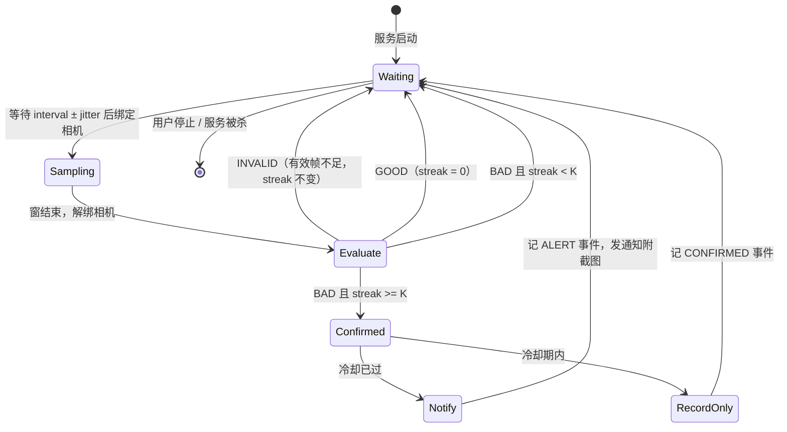

# 颈椎卫士 NeckGuard 设计文档

## 1. 背景与目标

长时间伏案时头部不自觉前伸（forward head posture，俗称"乌龟颈"）是颈椎劳损的主要诱因之一。本项目用一台放在身体侧面的摄像头设备，不定时抓拍并判断头部是否明显前倾，一旦确认就提醒用户，并附上当时的截图作为直观反馈。

分三个阶段推进：

| 阶段 | 检测端 | 通知方式 | 状态 |
|------|--------|----------|------|
| v1 | Android 手机 | 本机通知 + 截图 | 本文档主体 |
| v2 | Android 手机 | 上报服务器，服务器推送到主手机（iOS / Android） | 预留接口 |
| v3 | 独立硬件小盒子（树莓派 + 摄像头） | 同 v2 | 规划 |

v1 的目标是验证"侧面摄像头 + 姿态关键点 + 角度阈值"这条路线在真实场景里的误报率和漏报率是否可接受，为后两个阶段打基础。

## 2. 开源方案调研

| 来源 | 关键做法 | 借鉴点 |
|------|----------|--------|
| [spmallick/learnopencv: Posture-analysis-system-using-MediaPipe-Pose](https://github.com/spmallick/learnopencv/tree/master/Posture-analysis-system-using-MediaPipe-Pose) | 侧视图，耳肩连线与竖直夹角为颈部倾角，髋肩连线与竖直夹角为躯干倾角；`neck < 40 且 torso < 10` 为好姿势；左右肩 x 偏移 `< 100 px` 判定是否正侧面；连续 180 s 坏姿势才报警 | 角度公式、侧面对齐检查、持续时间门槛 |
| [tanisheesh/PosturePro](https://github.com/tanisheesh/PosturePro) | 同上算法的浏览器版 + Python 版，GPL-3 | 阈值一致性验证 |
| [DDULDDUCK/pose-nudge](https://github.com/DDULDDUCK/pose-nudge) | Rust + YOLO11n-pose 桌面应用，AGPL。先采集个人基线，之后按"当前值 > 基线 + 容差"判定；最近 3 次结果里至少 2 次异常才算异常 | 基线校准、时间窗投票去抖，对降低误报最有效 |
| [YoussefNim/forward_head_posture_alert](https://github.com/YoussefNim/forward_head_posture_alert) | 用耳 / 肩关键点的 z 深度差，阈值 0.35，持续 5 s | z 值不稳定，不采用；持续时间思路保留 |
| 临床文献（颅椎角 CVA） | 耳屏到 C7 连线与水平线的夹角，CVA < 50° 判为头前倾 | CVA 约等于 90° 减颈部倾角，与 40° 阈值吻合 |

结论：

- 只用 MediaPipe 的 2D 归一化坐标和 visibility，不用 z 深度。
- 只做侧视图，用户需求本身就是侧面摄像头。
- 融合三个要素：绝对阈值兜底、个人基线校准、连续窗投票 + 冷却。

## 3. 技术选型

| 项目 | 选型 | 说明 |
|------|------|------|
| 姿态模型 | MediaPipe Tasks Vision `com.google.mediapipe:tasks-vision:1.0.0` | 33 个关键点，含耳 (7/8)、肩 (11/12)、髋 (23/24)，每点带 visibility |
| 模型文件 | `pose_landmarker_lite.task`，约 5.8 MB | Gradle 任务在构建时下载到 assets，不提交二进制 |
| 相机 | CameraX 1.5.3 | ImageAnalysis 取帧，`STRATEGY_KEEP_ONLY_LATEST`，640x480，RGBA_8888 |
| 后台常驻 | `LifecycleService` + `foregroundServiceType="camera"` + partial WakeLock | Android 14+ 后台用相机的硬性要求 |
| UI | Jetpack Compose，BOM 2026.06.01，Material 3 | 三个页面，PreviewView 用 AndroidView 包一层 |
| 设置与事件 | DataStore Preferences + JSONL 事件文件 + JPEG 快照目录 | v1 不引入 Room |
| 构建 | AGP 8.13.2 / Gradle 8.14.5 / Kotlin 2.2.21 / JDK 17；compileSdk 36，targetSdk 35，minSdk 26 | Kotlin 2.2.x 与 AGP 8.13 兼容性最稳 |
| CI | GitHub Actions `ubuntu-latest`：`testDebugUnitTest` + `assembleDebug`，上传 `app-debug.apk` | 本机无 Android SDK |
| PC 原型 | Python 3.11 + `mediapipe==1.0.1` + `opencv-python` | 调阈值；也是 v3 树莓派的代码基础 |

不选 iOS 做检测端的原因：iOS 应用退到后台或锁屏后不能继续使用相机（需要 Apple 单独审批的 entitlement），且侧载签名 7 天过期，不适合长时间常驻。

## 4. 算法定义

Kotlin 端 `pose/PostureGeometry.kt`、`pose/PostureAnalyzer.kt` 与 Python 端 `tools/posture_geometry.py` 使用完全一致的定义。

### 4.1 选可见侧

左右耳分别取 visibility，更高的那一侧作为本帧的"近侧"，耳、肩、髋都取该侧的关键点。耳与肩的 visibility 都必须 `>= 0.5`，否则该帧记为 `LowVisibility`；关键点列表为空记为 `NoPerson`。

### 4.2 侧面对齐检查

```
torsoLen       = dist(shoulder, hip)          // 髋不可见时退化为 dist(ear, shoulder) * 2
shoulderOffset = |x_farShoulder - x_nearShoulder| / torsoLen
```

- `shoulderOffset < 0.35` 视为正侧面，帧结果为 `Valid`。
- 否则为 `Misaligned`，仅用于 UI 提示调整摆放角度，不计入判定。
- 远侧肩膀 visibility 低于 0.5 时视为被身体挡住，恰好说明是正侧面，offset 记为 0。

### 4.3 颈部倾角（主指标）

所有坐标先由归一化值乘以图像宽高还原为像素坐标，否则非正方形图像会让角度畸变。图像坐标 y 向下，竖直向上方向为 `(0, -1)`。

```
v    = ear - shoulder
cos  = (y_shoulder - y_ear) / |v|
neck = acos(cos)  转成角度，范围 0..180
```

耳在肩正上方为 0°，头越往前伸角度越大。同一公式用于躯干倾角 `torso = angle(hip -> shoulder)`，v1 只记录不报警，为后续坐姿检测预留。

### 4.4 校准与迟滞

- 校准：用户端正坐好点"校准"，取 3 s 内有效帧颈部角度的中位数作为 `baseline`；有效帧少于 10 则校准失败。
- 阈值：

```
threshold = baseline == null ? 40° : clamp(baseline + 12°, 30°, 50°)
```

- 迟滞：进入前倾需 `median > threshold`，退出前倾需 `median < threshold - 4°`，避免在临界值附近反复翻转。

### 4.5 采样窗状态机

- 调度：每 `interval`（默认 45 s）加 `±jitter`（默认 15 s）的随机抖动打开一个 `window`（默认 3 s）采样窗，窗内约 15 到 30 帧。
- 窗聚合：有效帧 `>= 8` 时取颈部角度中位数，否则窗结果为 `INVALID`，不改变连续计数。
- 判定：按 4.4 的迟滞规则得到 `GOOD` / `BAD`，`BAD` 时 `badStreak + 1`，`GOOD` 时清零。
- 确认：`badStreak >= K`（默认 2）即确认前倾。
- 冷却：确认后若距上次通知不足 `cooldown`（默认 10 min），只记录事件不通知。
- 快照：窗内角度最接近中位数的那一帧作为代表帧，画上耳肩髋连线和角度后存 JPEG。



所有参数在设置页可调，服务在每个采样窗前重新读取一次，修改即时生效。

## 5. Android 运行时设计

### 5.1 两种相机持有模式

| 模式 | 持有者 | 用例 | 说明 |
|------|--------|------|------|
| 预览模式 | `MainActivity`（摆放/校准页） | Preview + ImageAnalysis | 用户看画面、确认对齐、校准基线 |
| 监测模式 | `MonitorService` | 仅 ImageAnalysis | 只在采样窗内绑定，窗外解绑，省电且相机指示灯不常亮 |

两者互斥：点"开始监测"时 Activity 先解绑并停掉推理引擎，再启动服务；服务运行期间摆放页不开预览。

### 5.2 前台服务约束

- Manifest 声明 `FOREGROUND_SERVICE_CAMERA` 权限和 `foregroundServiceType="camera"`。
- Android 14+ 禁止从后台启动 camera 类型前台服务，因此只能由用户在 Activity 中点击启动；启动失败时捕获异常，写入状态总线并自停。
- 持有 partial WakeLock，锁屏后 CPU 不休眠，采样调度协程按时唤醒。
- `START_STICKY`：被系统杀掉后自动重建。
- 常驻通知显示上次采样结果、采样次数、提醒次数，并带"停止监测"动作。

### 5.3 异常处理清单

| 场景 | 处理 |
|------|------|
| 模型加载失败 | `PoseLandmarkerEngine.start()` 返回 false，服务记 ERROR 事件、发错误通知、自停 |
| 相机被占用 / 绑定失败 | `bindCamera()` 捕获异常，记 ERROR，跳过本窗，下个窗重试 |
| 采样窗 5 s 内无帧 | 记 ERROR"相机可能被占用"，本窗按 INVALID 处理 |
| 推理回调异常 | `onError` 上抛，记 ERROR，不影响循环 |
| 存图失败 | `SnapshotStore.save` 返回 null，事件照记，通知不带图 |
| 通知权限缺失 | `AlertNotifier.canPost()` 为 false 时丢弃通知并打日志，摆放页提示去授权 |
| 循环协程未捕获异常 | 记 ERROR、发错误通知、自停 |

所有异常都记入 `EventLog` 并反映在常驻通知和监测页，不允许崩溃。

### 5.4 线程模型

- CameraX 分析线程（单线程 Executor）：`ImageProxy` 转 Bitmap、旋转、送入 MediaPipe，随后立即关闭 `ImageProxy`。
- MediaPipe 内部串行队列：结果回调，做几何计算、`analyzer.addFrame`、JPEG 编码，最后回收 Bitmap。
- 调度协程（`Dispatchers.Default`）：等待、`beginWindow` / `endWindow`、写事件、发通知；相机绑定和解绑切到 `Dispatchers.Main`。
- `PostureAnalyzer` 全部方法 `@Synchronized`；窗内 JPEG 缓存用独立锁；`windowOpen` 用 `AtomicBoolean` 门控回调线程。
- 节流：`PoseLandmarkerEngine` 按 100 ms 最小间隔提交，且同一时刻只允许一帧在推理，避免堆积。

## 6. 模块清单

| 文件 | 职责 |
|------|------|
| `pose/PostureGeometry.kt` | 纯函数：选侧、像素坐标还原、颈部与躯干倾角、对齐比、帧结果分类 |
| `pose/PostureAnalyzer.kt` | 采样窗状态机：窗聚合、中位数、迟滞、连续计数、冷却、校准、代表帧 |
| `pose/PoseLandmarkerEngine.kt` | MediaPipe LIVE_STREAM 封装：模型加载、帧旋转、节流、结果与错误回调 |
| `monitor/MonitorService.kt` | camera 类型前台服务：WakeLock、采样调度、按窗绑定/解绑相机、事件处理 |
| `monitor/MonitorBus.kt` | 进程内 `StateFlow` 状态总线，服务写、UI 读 |
| `monitor/SnapshotStore.kt` | JPEG 编码、叠加连线与角度、落盘、保留最近 50 张 |
| `monitor/AlertNotifier.kt` | 通知渠道、常驻状态通知、BigPicture 前倾提醒、错误通知 |
| `data/SettingsRepository.kt` | DataStore 持久化全部可调参数与基线 |
| `data/EventLog.kt` | JSONL 追加写与读取最近 N 条，超 2000 行自动裁剪 |
| `report/EventSink.kt` | 事件出口接口；v1 `LocalNotificationSink`，`CompositeSink` 支持多出口 |
| `ui/SetupScreen.kt` | 预览 + 叠加层 + 对齐状态 + 校准 + 开始监测 |
| `ui/LivePreviewController.kt` | 摆放页的相机与推理生命周期、fps 统计、校准采样 |
| `ui/PoseOverlay.kt` | Compose Canvas 画耳肩髋连线，处理 FIT_CENTER 与前置镜像 |
| `ui/MonitorScreen.kt` | 运行状态、倒计时、上次采样、事件列表与截图、停止 |
| `ui/SettingsScreen.kt` | 全部参数编辑、清空事件、调试开关 |
| `NeckGuardApp.kt` / `MainActivity.kt` | 通知渠道创建；权限申请、三页导航、通知点击跳转 |
| `tools/posture_geometry.py` | 与 Kotlin 一致的 Python 算法实现 |
| `tools/posture_probe.py` | 照片批量分析 / 实时摄像头，用于调阈值 |

## 7. 验证方案

### 7.1 单元测试（CI 每次执行）

- `PostureGeometryTest`：耳在肩正上方 0°、水平 90°、对角 45°、镜像对称；像素坐标而非归一化坐标；左右侧选择；低可见度、无人、未对齐、远肩遮挡、髋缺失。
- `PostureAnalyzerTest`：中位数奇偶；阈值 clamp；INVALID 窗不动 streak；未对齐帧只计数；K 连续确认；GOOD 清零；冷却压制与恢复；迟滞进出；校准重置状态；代表帧最接近中位数；躯干中位数忽略 null。

### 7.2 PC 原型

用用户提供的侧面照片（端正 / 前倾各若干张，同一摆放角度）跑 `posture_probe.py --image`，确认两类角度的分离度。目标：前倾组比端正组至少大 12°，否则调整 delta 或绝对阈值后再写回 Kotlin 默认值。

### 7.3 真机

1. Actions 下载 APK 安装，授予相机与通知权限。
2. 手机置于身体侧面 1 到 1.5 m、与肩齐平，摆放页显示"已对齐"，完成校准。
3. 开始监测，锁屏，故意前倾 2 分钟，应收到带截图的通知；恢复端坐，冷却期后不再报。
4. 观察 1 小时耗电与服务存活情况，国产 ROM 按 README 关闭电池优化。

## 8. v2：服务器与推送

- 检测端新增 `ServerSink`，实现 `EventSink.deliver`，以 multipart 上报事件与截图；失败进入本地重试队列，网络恢复后补发。
- 服务端用 Spring Boot（与 ai-server 同栈），截图存 MinIO，事件落库。
- 推送统一用自建 ntfy（iOS / Android 都有官方客户端，支持图片附件，`Attach` 头传 MinIO 预签名 URL），iOS 备选 Bark。
- 检测端设置页增加服务器地址、设备 token、上报开关。

接口草案：

```
POST /api/posture/events
Content-Type: multipart/form-data
Authorization: Bearer <deviceToken>

字段
  deviceId      string   检测端唯一标识
  ts            long     事件时间戳（毫秒）
  type          string   ALERT | CONFIRMED
  neckDeg       float    颈部倾角中位数
  torsoDeg      float    躯干倾角中位数，可空
  thresholdDeg  float    当时的报警阈值
  file          binary   带标注的 JPEG 截图，可空

响应 200
  { "id": "evt_xxx", "pushed": true }
```

## 9. v3：硬件小盒子

- 树莓派 Zero 2 W 或 Pi 4 + CSI 摄像头，Python 直接复用 `tools/posture_geometry.py` 的算法模块和 `PostureAnalyzer` 状态机。
- 采样是间歇式的，1 到 2 fps 足够，Pi 4 跑 lite 模型可满足；Pi Zero 2 W 需实测。
- 上报走 v2 的同一接口，检测端与手机端互换无感。
- 更低成本备选：ESP32-S3 摄像头只负责定时拍照上传，推理放在服务器。
